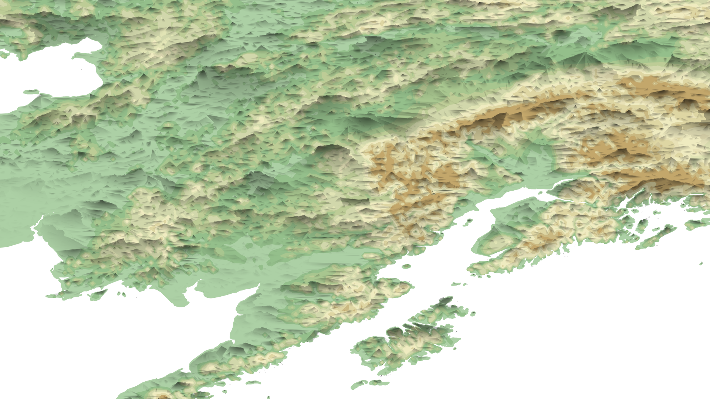
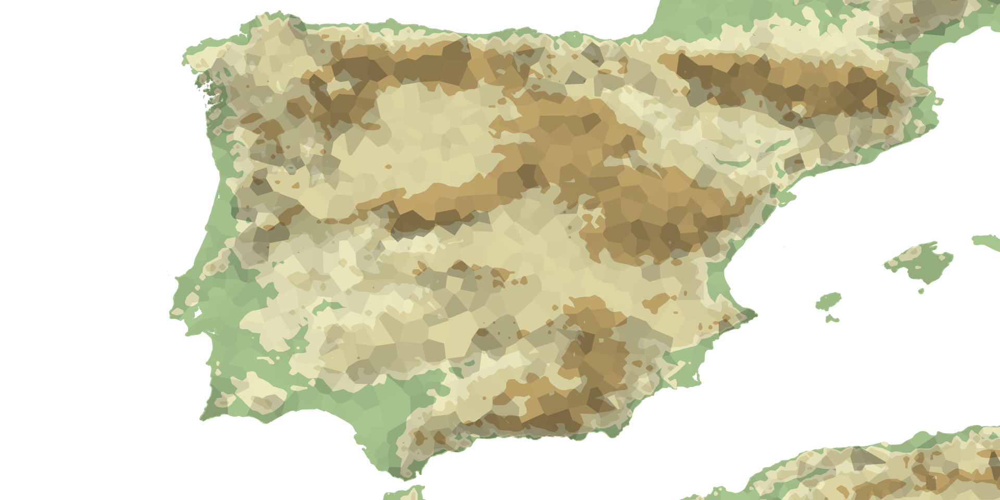
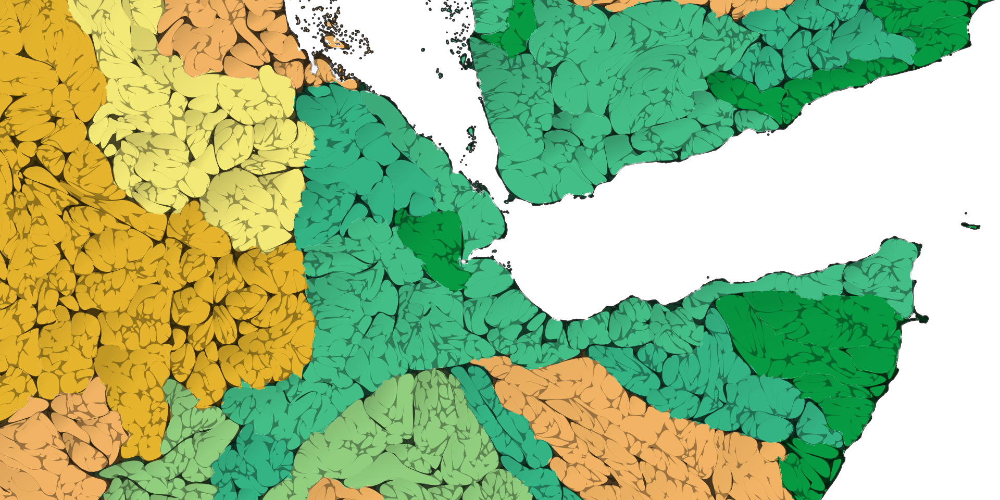
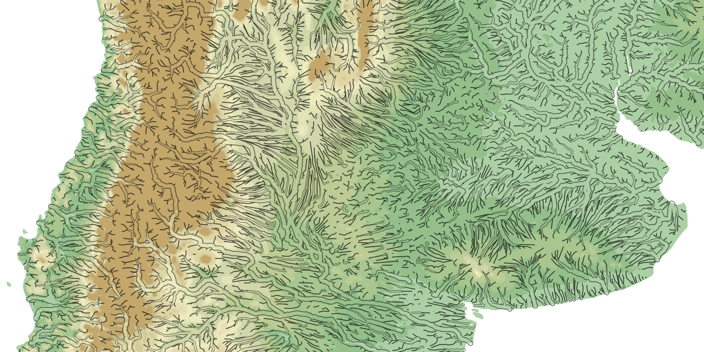
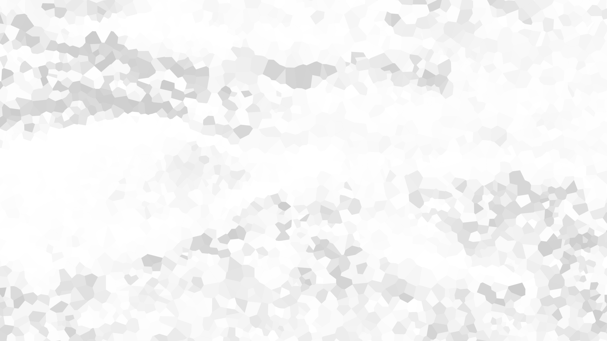
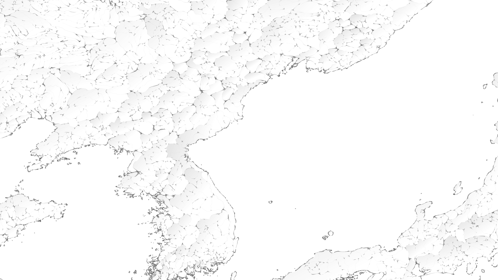
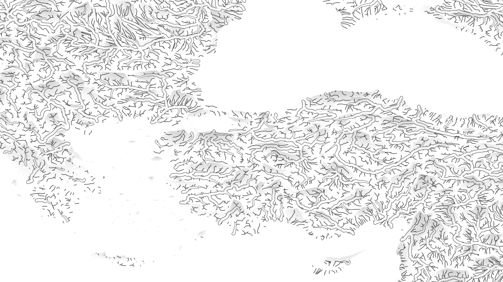

# base-layers

My collection of rasters I use to instantly add style to a map -- combine with color, label or thematic layers. Open in QGIS, Photoshop, any software that works with georeferenced tifs.

## Usage

These maps use base-layers:  

## Downloads

Rasters are in 20x20 degree tiles, organized by style.

[Shade directory](https://github.com/geographyclub/base-layers/tree/main/shade)

[Shade2 directory](https://github.com/geographyclub/base-layers/tree/main/shade2)

[Hatching directory](https://github.com/geographyclub/base-layers/tree/main/hatching)

[Basins directory](https://github.com/geographyclub/base-layers/tree/main/basins)

[Rivers directory](https://github.com/geographyclub/base-layers/tree/main/rivers)

## How to use

TO DO.

## Data sources

HydroATLAS  
Natural Earth  
OpenStreetMap  
SRTM  
