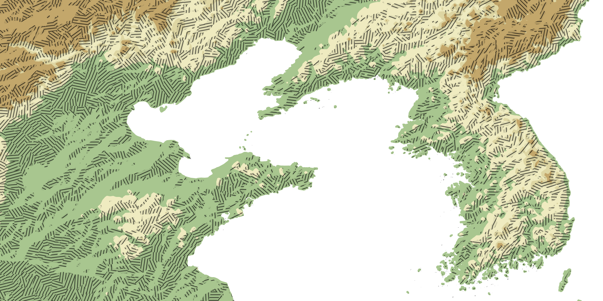
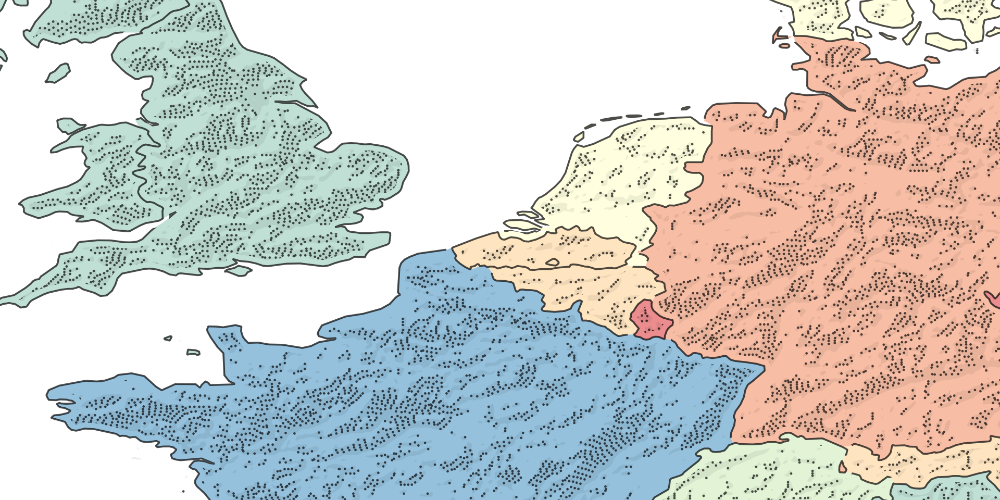
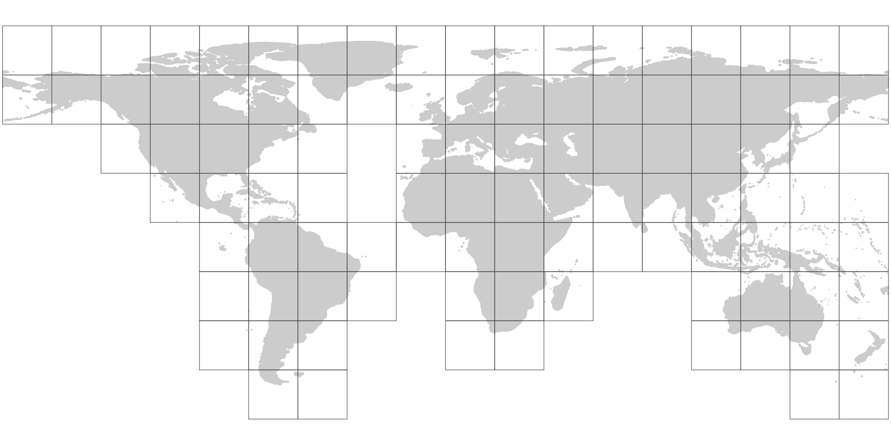
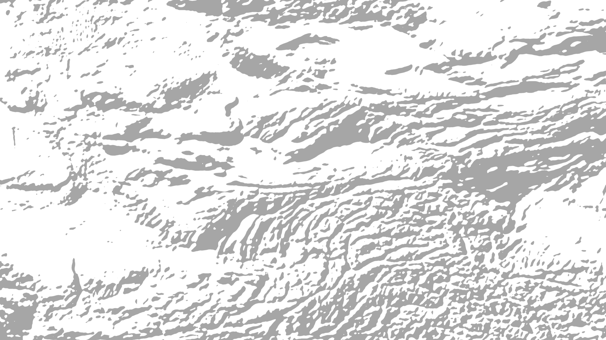
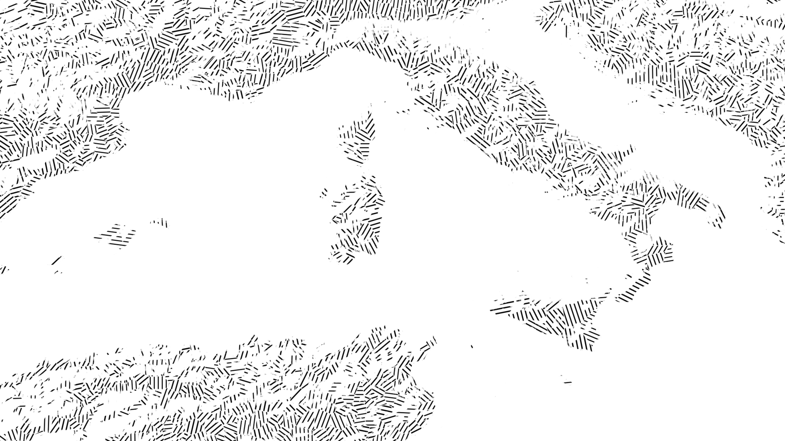
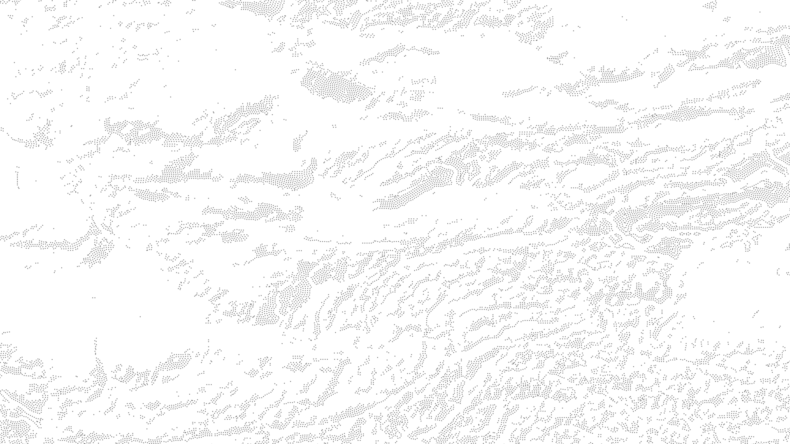

# base-layers

My collection of generalized topo rasters I use to instantly add shading and texture to a map. Open in QGIS, Photoshop, any software that works with georeferenced tifs.

## Example usage

These maps use base-layers:  




## Downloads

Rasters are in 20x20 degree tiles, organized by style.



[Solid directory](https://github.com/geographyclub/base-layers/tree/main/solid)



[Hatching directory](https://github.com/geographyclub/base-layers/tree/main/hatching)



[Stippling directory](https://github.com/geographyclub/base-layers/tree/main/stippling)



## crop and convert base-layer

```bash
convert -gravity Center -geometry 1920x1080^ -crop 1920x1080+0+0 shade2/xmin_-80_xmax_-60_ymin_-50_ymax_-30.tif shade2_xmin_-80_xmax_-60_ymin_-50_ymax_-30.png
```

## How to use

TO DO.

## Data sources

HydroATLAS  
Natural Earth  
OpenStreetMap  
SRTM  
