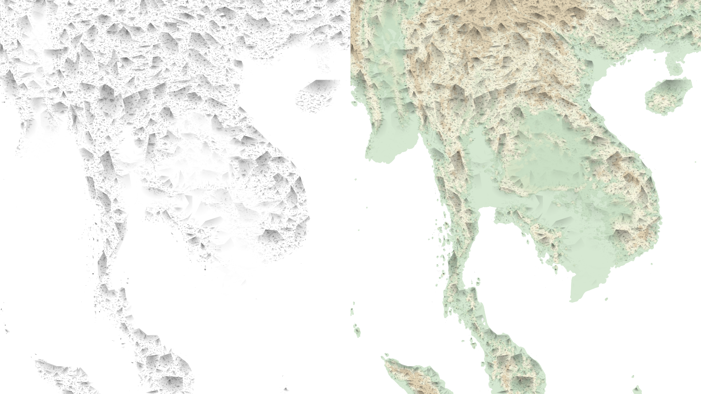

# base-layers

My collection of "artsy" georeferenced rasters of stylized topography and other earth features. Open in QGIS, Photoshop, any software that works with tifs.

[Topo1](https://github.com/geographyclub/base-layers/tree/main/topo1/grid20)

## Data sources

NASA SRTM
HydroATLAS
Natural Earth
OpenStreetMap
