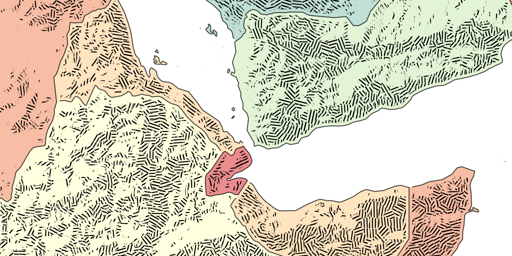
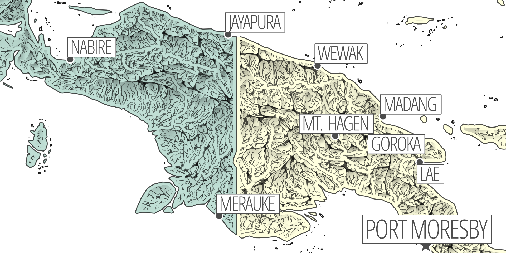
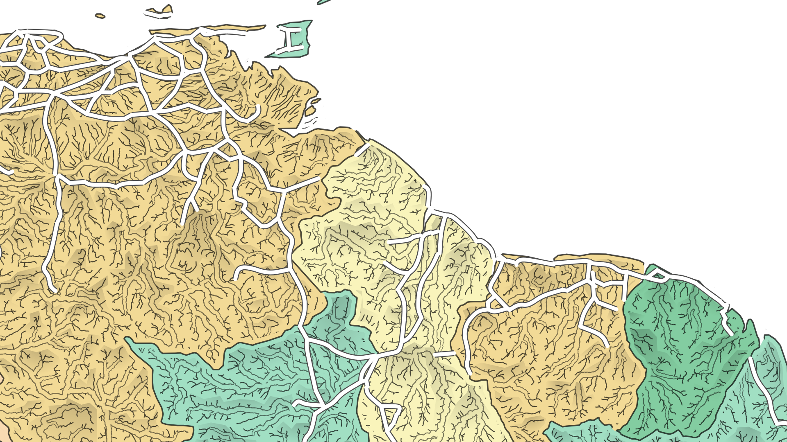

# base-layers

My collection of stylish map layers to build on. Open in QGIS, Photoshop, any software that works with georeferenced tifs.

## Usage

These maps use base-layers:  

## Downloads

Rasters are in 20x20 degree tiles.

[Shade](https://github.com/geographyclub/base-layers/tree/main/shade)

[Hatching](https://github.com/geographyclub/base-layers/tree/main/hatching)

[Basins](https://github.com/geographyclub/base-layers/tree/main/basins)

[Rivers](https://github.com/geographyclub/base-layers/tree/main/rivers)

## How to use

TO DO.

## Data sources

HydroATLAS  
Natural Earth  
OpenStreetMap  
SRTM  
