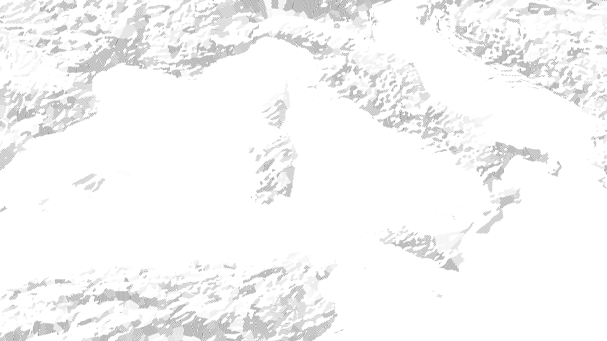
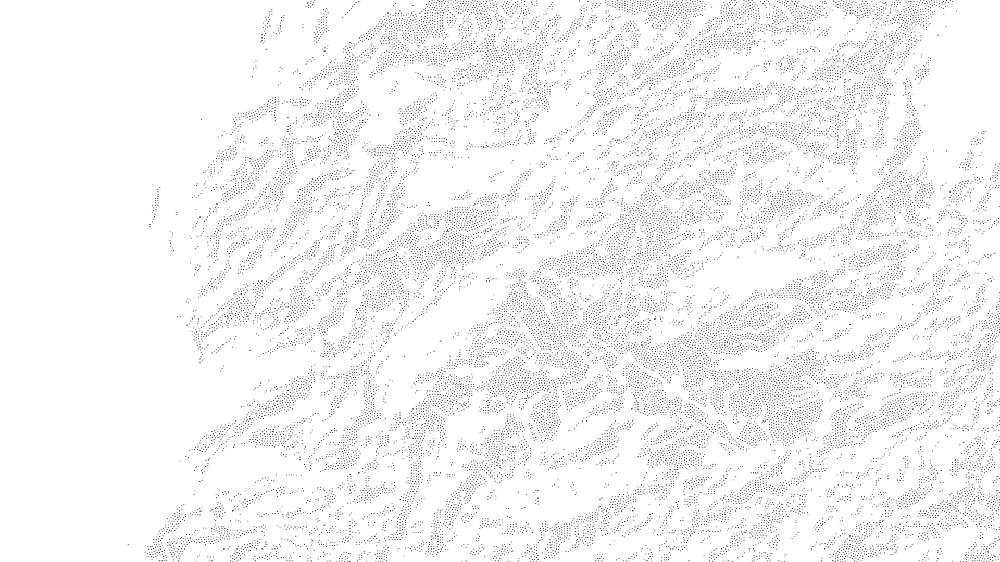

# base-layers

My collection of generalized topo rasters I use to instantly add shading and texture to a map. Open in QGIS, Photoshop, any software that works with georeferenced tifs.

## Example usage

These maps use base-layers:  

## Downloads

Rasters are in 20x20 degree tiles, organized by style.

[Solid directory](https://github.com/geographyclub/base-layers/tree/main/solid)

[Hatching directory](https://github.com/geographyclub/base-layers/tree/main/hatching)

[Stippling directory](https://github.com/geographyclub/base-layers/tree/main/stippling)

## How to use

TO DO.

## Data sources

HydroATLAS  
Natural Earth  
OpenStreetMap  
SRTM  
